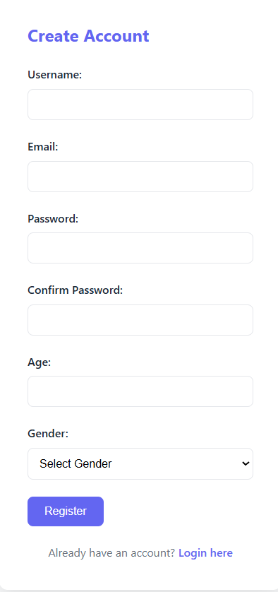
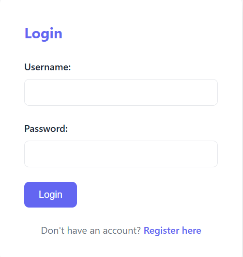
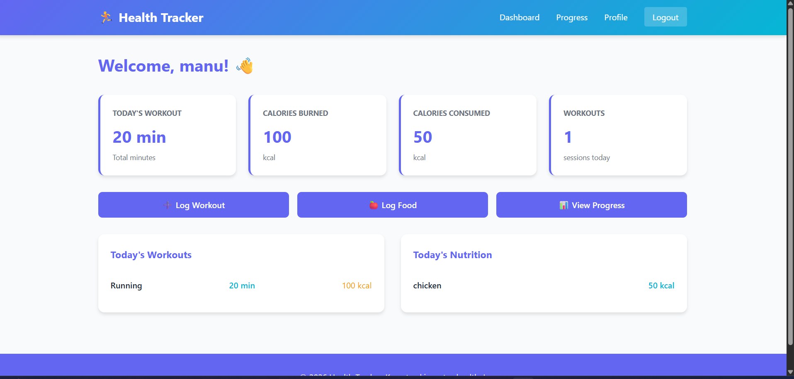
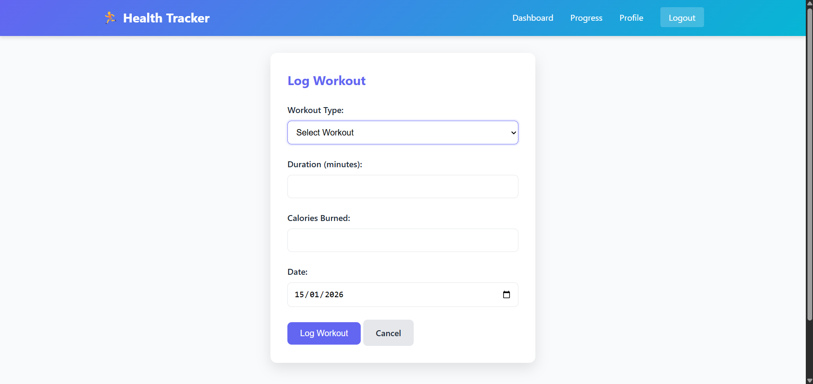
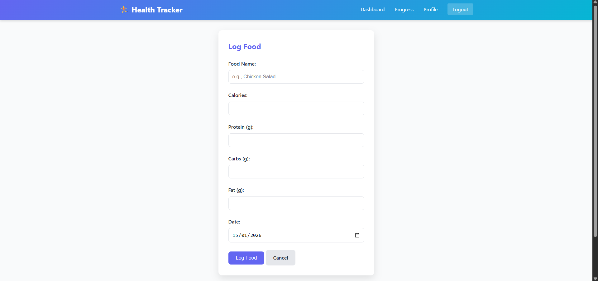
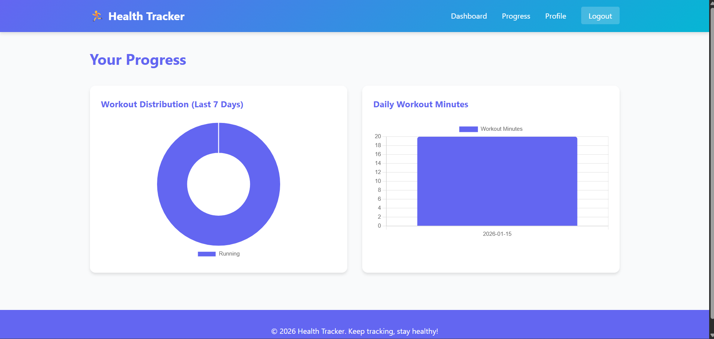

# Health Tracker System

A comprehensive Flask-based health and fitness tracking application built with Python, HTML, CSS, and SQLite.

## Features

- **User Authentication**: Secure login and registration with password hashing
- **Workout Tracking**: Log different types of workouts (Running, Cycling, Swimming, Yoga, Gym, Walking)
- **Nutrition Logging**: Track daily food intake with calorie and macronutrient information
- **Progress Charts**: Visualize your fitness progress with interactive charts (Doughnut and Bar charts)
- **User Profile**: Manage personal information (age, height, weight, gender)
- **Dashboard**: Real-time overview of today's activities and statistics

## Tech Stack

- **Backend**: Flask (Python web framework)
- **Database**: SQLite (lightweight, file-based database)
- **Frontend**: HTML5, CSS3, Jinja2 templating
- **Charts**: Chart.js for data visualization
- **Security**: Werkzeug for password hashing

## Installation & Setup

### Prerequisites
- Python 3.7 or higher
- pip (Python package manager)

### Step 1: Install Dependencies

```bash
pip install -r requirements.txt
```

### Step 2: Run the Application

```bash
python app.py
```

The application will start on `http://localhost:5000`

### Step 3: Access the Application

1. Open your browser and go to `http://localhost:5000`
2. You'll be redirected to the login page
3. Click "Register here" to create a new account
4. Fill in your details and create your account
5. Log in with your credentials

## Project Structure

```
health-tracker/
│
├── app.py                      # Main Flask application
├── requirements.txt            # Python dependencies
├── health_tracker.db          # SQLite database (created automatically)
│
├── templates/
│   ├── base.html              # Base template with navigation
│   ├── login.html             # Login page
│   ├── register.html          # Registration page
│   ├── dashboard.html         # Main dashboard
│   ├── add-workout.html       # Add workout form
│   ├── add-nutrition.html     # Add nutrition form
│   ├── progress.html          # Progress charts page
│   └── profile.html           # User profile page
│
└── static/
    ├── style.css              # Main CSS styles
    └── (future: JavaScript files)
```

## Database Schema

### Users Table
- `id`: Primary key
- `username`: Unique username
- `email`: User email
- `password`: Hashed password
- `age`: User age
- `height`: Height in cm
- `weight`: Weight in kg
- `gender`: User gender
- `created_at`: Account creation timestamp

### Workouts Table
- `id`: Primary key
- `user_id`: Foreign key to users
- `workout_type`: Type of workout (Running, Cycling, etc.)
- `minutes`: Duration in minutes
- `calories_burned`: Calories burned
- `date`: Workout date
- `created_at`: Timestamp

### Nutrition Logs Table
- `id`: Primary key
- `user_id`: Foreign key to users
- `food_name`: Name of the food item
- `calories`: Calories consumed
- `protein`: Protein in grams
- `carbs`: Carbohydrates in grams
- `fat`: Fat in grams
- `date`: Food log date
- `created_at`: Timestamp

### Reminders Table
- `id`: Primary key
- `user_id`: Foreign key to users
- `reminder_type`: Type of reminder
- `message`: Reminder message
- `scheduled_time`: Scheduled time
- `is_active`: Active status
- `created_at`: Timestamp

## Features Walkthrough

### Dashboard
- View today's workout summary
- Track calories burned vs. consumed
- Quick action buttons to log activities
- See recent workouts and meals

### Add Workout
- Select workout type from a dropdown
- Enter duration in minutes
- Track calories burned
- Choose date for the workout

### Add Nutrition
- Log food items with calorie count
- Track macronutrients (protein, carbs, fat)
- Set the date for the meal
- View daily nutrition totals

### Progress
- View workout distribution over the last 7 days
- See daily workout minutes in a bar chart
- Analyze trends in your fitness data

### Profile
- View account information
- Update personal metrics
- Track your fitness journey data

## Usage Tips

1. **Set Up Profile**: Complete your profile with height and weight for better recommendations
2. **Log Regularly**: Log workouts and meals daily for accurate tracking
3. **Check Progress**: Review charts weekly to identify trends
4. **Stay Consistent**: Use reminders to maintain regular logging habits

## Security Notes

- Passwords are hashed using Werkzeug's security functions
- Session management is handled by Flask
- Database file should be backed up regularly
- Change the secret key in `app.py` before deploying to production

```bash
app.secret_key = 'your-secret-key-change-in-production'
```

## Troubleshooting

### Database Issues
If you encounter database errors, delete `health_tracker.db` and restart the app. It will create a fresh database.

### Port Already in Use
If port 5000 is already in use, modify the last line in `app.py`:
```python
app.run(debug=True, port=5001)
```

### Import Errors
Make sure all dependencies are installed:
```bash
pip install --upgrade -r requirements.txt
```

## Future Enhancements

- Email reminders for logging activities
- Social sharing of progress
- Meal planning suggestions
- Integration with fitness wearables
- Mobile app version
- Advanced analytics and reports

## License

This project is open source and available for personal use.

## Support

For issues or questions, please check the troubleshooting section or review the code comments.

---

**Happy Tracking!** Keep pushing towards your fitness goals! 💪






